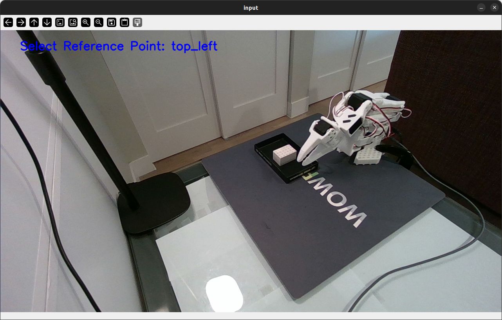
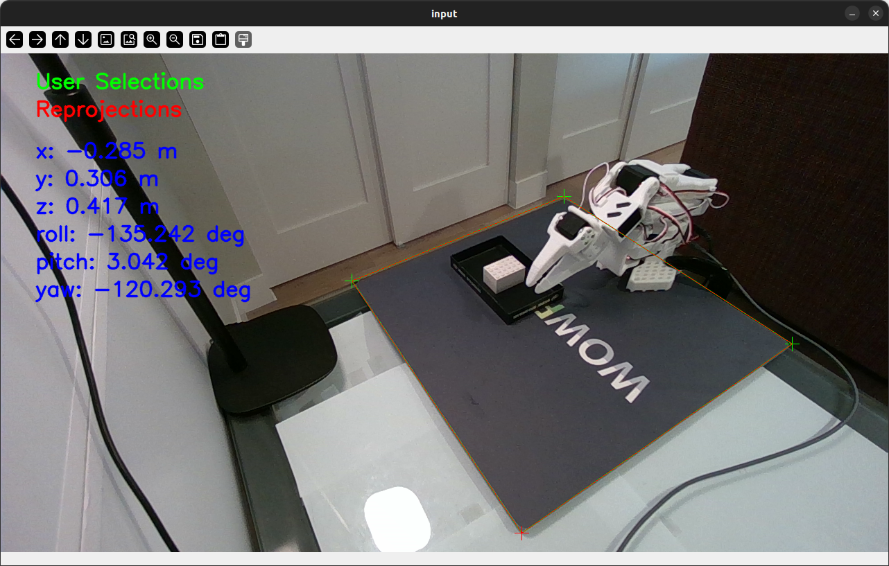

# polyROIExtrinsics

This tool can be used to determine the current pose of a camera in a scene when an object of known location and size is visible. It serves as an alternative to using visual fiducial markers, as those can be challenging to set up in some cases.

This repo is a fork of [Morpheus3000/polyROISelector](https://github.com/Morpheus3000/polyROISelector), from which the high-level polygon ROI selector implementation was derived. This fork reduces selection functionality to the subset relevant for camera pose estimation, and adds the relevant calculations and visualization.

## Usage

To use this tool, an object of known size and location must be visible in the camera frame. Currently, the tool only supports square objects (e.g. visual fiducial markers), where the four coplanar corners of the square object are selected by the user. However, the implementation can easily be extended to support any arbitrary polygonal object.

The following inputs are required for use:

- An image from the camera containing the object
- The 3D coordinates of each of the object's corners in the relevant reference frame (e.g. world frame)
- The 3x3 camera matrix saved as a Numpy array
- The camera distortion coefficients (k1, k2, p1, p2, k3) saved as a Numpy array 

These inputs should be specified in [`example.py`](/example.py), which is the program entry point.

When the program is run, the user will be prompted to select each corner of the object, with markers and guidelines being placed in green for assistance. Once all four corners are selected, the camera pose will be calculated and saved to a file, and the object reprojected into the image frame in red for reference.

Below is an example use case, where the reference object is a 40x40cm gray mat:

|  |  |
| :---: | :---: |
|  |  |
| *Example Input* | *Example Result* |